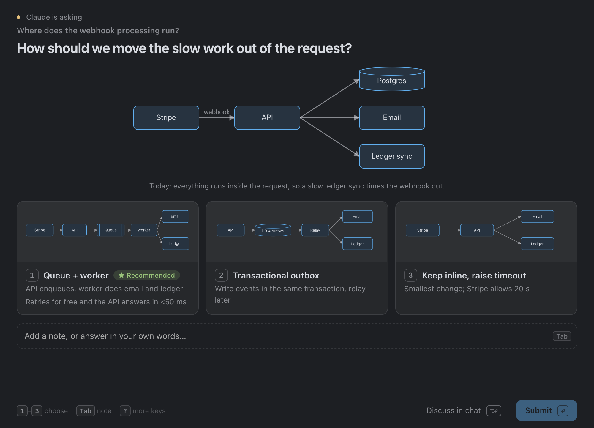
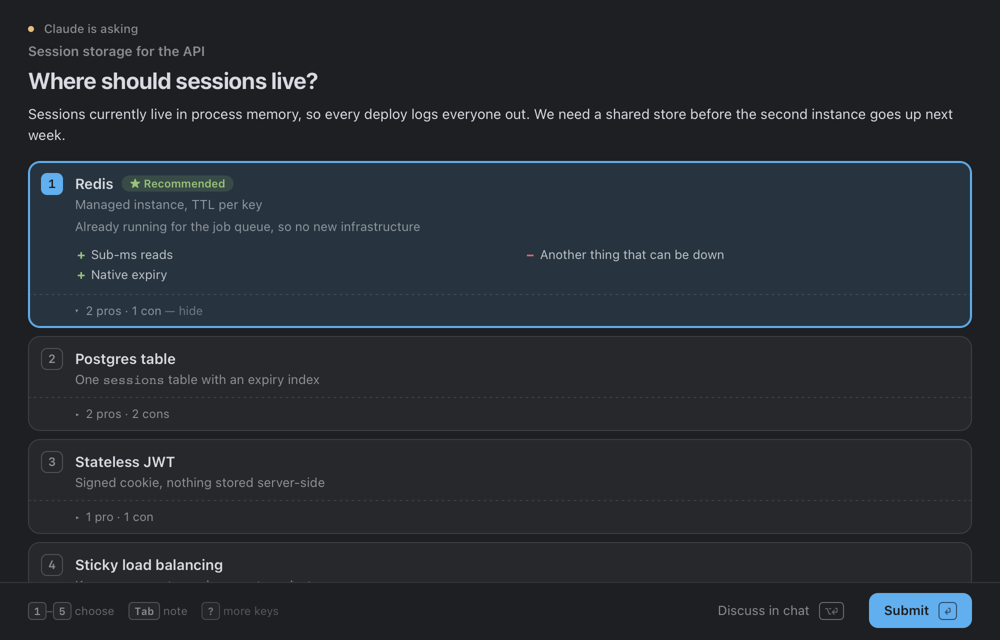
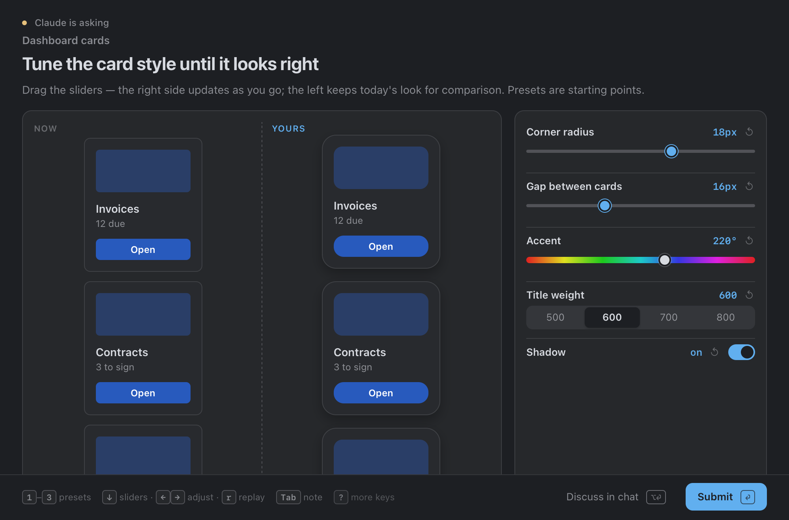
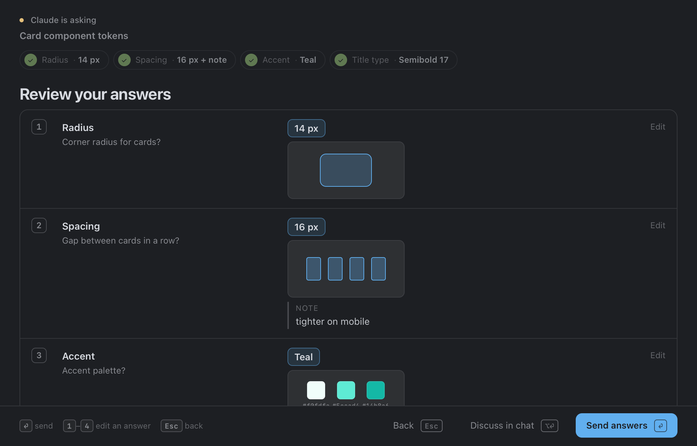

# huddle

Ask questions as a page in an agterm overlay — pictures, charts, sliders. Part of
[claude-skills](../../README.md).

```
/plugin marketplace add skkap/claude-skills
/plugin install huddle@skkap-skills
```

---

## `huddle` — ask with a page, not a prompt

Inside [agterm](https://github.com/umputun/agterm), replaces Claude Code's
built-in question tool with a page in an HTML overlay over the agent's own
session. The agent writes a small JSON spec — or one line,
`huddle q "Which store?" "*Redis|already runs" "Postgres|no new service"` — and
gets the answer back as JSON. It ships ten templates, so a question is filled in,
not designed.

Four things it does differently:

**The answer can be a picture.** An option can carry a preview — an SVG diagram,
a wireframe, a radius, spacing or colour sample, a chart — and the evidence goes
under the question: diagrams, charts, stat tiles, tables, code, diffs. Nothing is
fetched from the network; a diagram is plain SVG the agent writes.



**More than four options, with the reasoning attached.** Up to nine, each with a
grey subtitle, a Recommended badge that says why, and pros and cons behind a
details row. Every question also has a free-text box: the note travels with the
choice, or replaces it.



**Taste gets sliders, not a multiple choice.** When a value has no standard step
— a radius, a gap, a hue, a duration — the agent declares the controls and a
preview. The preview updates as you drag, presets move the sliders, the starting
look stays beside yours, and the final values come back with the answer.



**Several questions, then the list.** Related decisions go on one page as tabs
that show the answer so far. Before anything is sent, a review lists every
answer, with a thumbnail of a visual one and the note you typed; a number key
jumps back to edit it.



Keys throughout: `1`–`9` choose, arrows move, `Tab` writes a note, `Enter` sends,
`⌥Enter` says "let's talk in the terminal instead". The page takes the terminal
theme's colours. While a question waits, the session's sidebar row shows it is
asking.

Needs agterm 0.34 or later (pages that answer the script that opened them) and
Python 3. Outside agterm it opens the page in the browser instead. Personal
defaults — style, panel size, the status glyph — live in
`~/.config/huddle/defaults.json`. Agents still reach for the built-in tool out
of habit, so say it once in your `CLAUDE.md`:

```markdown
Inside agterm, ask me questions with the huddle skill instead of AskUserQuestion.
```
